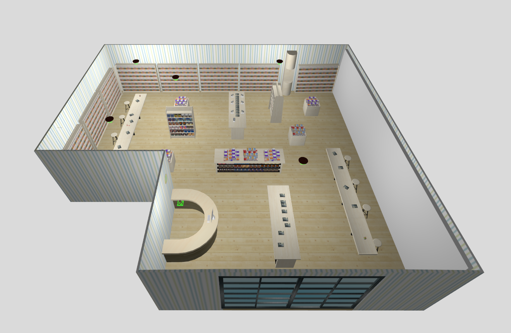
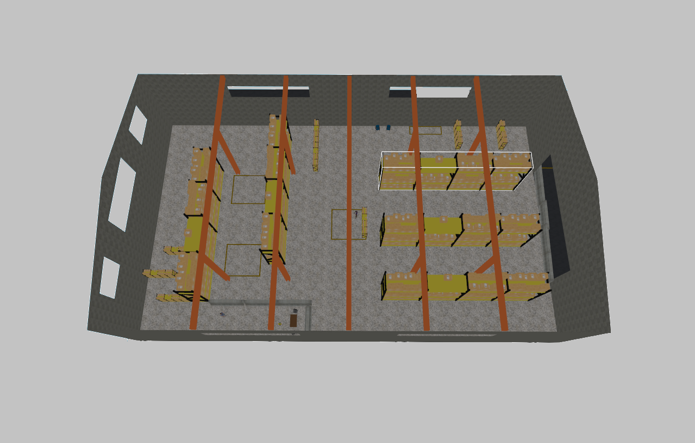
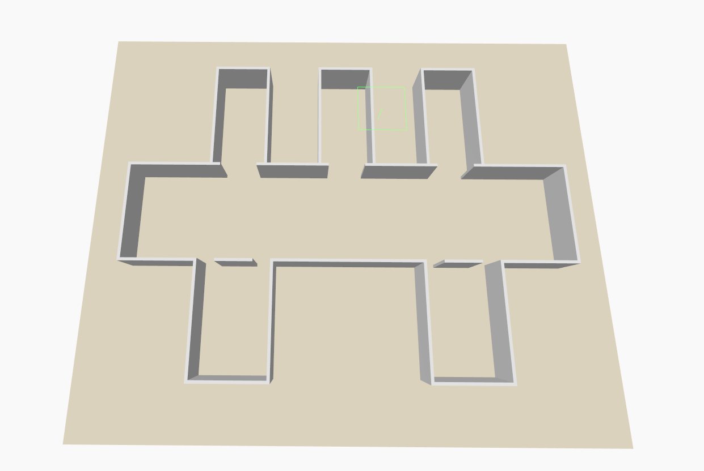
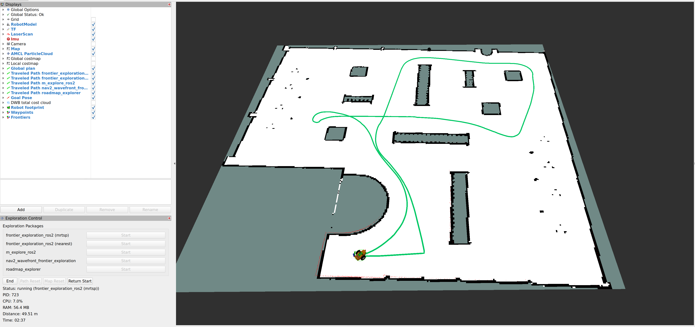
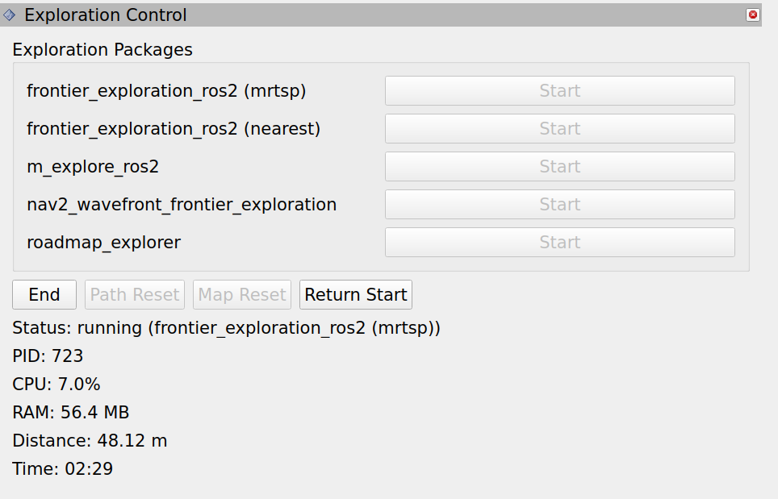

# Autonomous Exploration Package Demo & Benchmarks

[](https://github.com/mertgulerx/autonomous-exploration-demo-benchmark/graphs/contributors)
[](https://github.com/mertgulerx/autonomous-exploration-demo-benchmark/stargazers)
[](https://github.com/mertgulerx/autonomous-exploration-demo-benchmark/issues)
[](https://github.com/mertgulerx/autonomous-exploration-demo-benchmark/blob/main/LICENSE)

A ROS 2 Jazzy benchmark workspace created to compare multiple autonomous exploration packages under a shared simulation and evaluation setup. Primarly focuses on indoor usage.

The repository brings together a simulaton environment, multiple exploration packages, benchmark utilities, and result reporting so exploration behavior can be compared more fairly.

An extra purpose of this repository is testing stability and correctness of the [frontier_exploration_ros2](https://github.com/mertgulerx/frontier_exploration_ros2) package.

## Table of Contents

- [Overview](#overview)
- [Resources and Citation](#resources-and-citation)
- [World Inventory](#world-inventory)
- [Benchmark Results](#benchmark-results)
- [Build and Run](#build-and-run)
- [Usage](#usage)
- [Contributing](#contributing)
- [frontier_exploration_ros2 Integration](#frontier_exploration_ros2-integration)

- [Thanks](#thanks)
- [License](#license)
- [Maintainer](#maintainer)

## Overview

This repository is designed as a practical comparison bench for autonomous exploration in ROS 2. Instead of evaluating each package in isolation, it places multiple exploration packages into a shared workspace with a common simulation environment, matching runtime assumptions, and a consistent observation workflow.

The current benchmark layout contains:

- a core Gazebo Harmonic and ROS 2 Jazzy simulation stack
- Nav2 and SLAM environment
- multiple exploration packages with different strategies and implementations
- utility tooling for easier launch, RViz interaction, and benchmark support
- a results section intended to present both visual outputs and comparison tables

## Resources and Citation

This benchmark uses upstream packages and simulation resources. **Care has been taken to respect the licenses of all packages without making unauthorized modifications.**

For any inquiries or concerns related to these, please [contact me](#maintainer).

### Simulation Environment

1. `Week-7-8-ROS2-Navigation`
   - Role: Core simulation, robot, navigation, SLAM, and baseline worlds
   - License: `Apache-2.0`
   - Source: [MOGI-ROS/Week-7-8-ROS2-Navigation](https://github.com/MOGI-ROS/Week-7-8-ROS2-Navigation)
   - Commit: [a0313beb9795fa99e7ff42ba1f7a3fe450571f2a](https://github.com/MOGI-ROS/Week-7-8-ROS2-Navigation/commit/a0313beb9795fa99e7ff42ba1f7a3fe450571f2a)

### Exploration Packages

1. `frontier_exploration_ros2`
   - License: `Apache-2.0`
   - Source: [mertgulerx/frontier_exploration_ros2](https://github.com/mertgulerx/frontier_exploration_ros2)
   - Commit: [6655b3a3a765051e865f3e2544dfa8a21368d8a1](https://github.com/mertgulerx/frontier_exploration_ros2/commit/6655b3a3a765051e865f3e2544dfa8a21368d8a1)
2. `m-explore-ros2 (slam_toolbox branch)`
   - License: `BSD`
   - Source: [robo-friends/m-explore-ros2](https://github.com/robo-friends/m-explore-ros2)
   - Commit: [9b64d8d35213dd50bc44f1b5b4959c1f58c32d2e](https://github.com/robo-friends/m-explore-ros2/commit/9b64d8d35213dd50bc44f1b5b4959c1f58c32d2e)
3. `nav2_wavefront_frontier_exploration`
   - License: `MIT`
   - Source: [SeanReg/nav2_wavefront_frontier_exploration](https://github.com/SeanReg/nav2_wavefront_frontier_exploration)
   - Commit: [07473294204663473fd6ae058729c4bba71b6074](https://github.com/SeanReg/nav2_wavefront_frontier_exploration/commit/07473294204663473fd6ae058729c4bba71b6074)

4. `roadmap-explorer`
   - License: `Apache License 2.0`
   - Citation: `S. Saravanan, A. Bains, C. Chanel, D. Vivet, "FIT-SLAM 2: Efficient 3D Exploration with Fisher Information and Traversability Based Adaptive Roadmap"`
   - Source: [suchetanrs/roadmap-explorer](https://github.com/suchetanrs/roadmap-explorer)
   - Commit: [68859c51a94628507edbce16b20ba4d8c52e3208](https://github.com/suchetanrs/roadmap-explorer/commit/68859c51a94628507edbce16b20ba4d8c52e3208)

### Worlds

1. `warehouse`
   - License: `BSD-3-Clause`
   - Source: [clearpathrobotics/clearpath_simulator](https://github.com/clearpathrobotics/clearpath_simulator)
   - Commit: [7b9930bd5b4ca1136a5a03982cd6269e9a2f75e9](https://github.com/clearpathrobotics/clearpath_simulator/commit/7b9930bd5b4ca1136a5a03982cd6269e9a2f75e9)

## World Inventory

The current benchmark includes two different worlds with unique properties to test packages extensively.
Custom worlds are also supported and can be used easily.

### Bookstore

A complex maze like environment. Slightly modified and Gazebo Harmonic ported version of the [AWS RoboMaker Bookstore](https://github.com/aws-robotics/aws-robomaker-bookstore-world) world.



## Warehouse

A **1,500 m² (16,000 sq ft)** warehouse facility. Complex, large and resource consuming.
Closest environment to evaluate realistic performance. Great for testing scalability.
**Requires a powerful CPU to simulate.**



## Corridor

A small algorithm confusing environment to test zig-zag path complexity. Custom made and based on the [research paper](https://www.nature.com/articles/s41598-025-97231-9).



## Benchmark Results

Benchmark results were obtained using the default configurations provided in the repository. Results may vary depending on custom parameters and environments.

### Bookstore

The `Bookstore` environment demonstrates how exploration behaves in a **medium size and dense maze-like environment**.

Spanning **225 m² (2,400 sq ft)**.

#### Path Complexity Results

<table width="74%" align="center">
  <tr>
    <td width="50%" align="center">
      
    </td>
    <td width="50%" align="center">
      
    </td>
  </tr>
  <tr>
    <td align="center"><small>frontier_exploration_ros2 (MRTSP)</small></td>
    <td align="center"><small>frontier_exploration_ros2 (nearest)</small></td>
  </tr>
</table>

<table width="74%" align="center">
  <tr>
    <td width="50%" align="center">
      
    </td>
    <td width="50%" align="center">
      
    </td>
  </tr>
  <tr>
    <td align="center"><small>m_explore_ros2</small></td>
    <td align="center"><small>nav2_wavefront_frontier_exploration</small></td>
  </tr>
</table>

<table width="74%" align="center">
  <tr>
    <td width="50%" align="center">
      
    </td>
    <td width="50%" align="center">
      
    </td>
  </tr>
  <tr>
    <td align="center"><small>roadmap-explorer</small></td>
    <td align="center"><small></small></td>
  </tr>
</table>

#### Benchmark Metrics

| Package                               | Single Core CPU Usage (%) | RAM Usage (MB) | Distance Traveled (m) | Time Elapsed (mm:ss) | Time Elapsed (s) |
| ------------------------------------- | ------------------------- | -------------- | --------------------- | -------------------- | ---------------- |
| `frontier_exploration_ros2 (mrtsp)`   | 7.4                       | 56.5           | 36.60                 | 01:03                | 63               |
| `frontier_exploration_ros2 (nearest)` | 4.0                       | 56.6           | 37.72                 | 01:13                | 73               |
| `m_explore_ros2`                      | 2.4                       | 51.9           | 50.73                 | 01:36                | 96               |
| `nav2_wavefront_frontier_exploration` | 10.3                      | 100.7          | 52.85                 | 02:49                | 169              |
| `roadmap-explorer`                    | 32.8                      | 111.8          | 39.28                 | 01:12                | 72               |

<br>

<table width="74%" align="center">
  <tr>
    <td width="50%" align="center">
      
    </td>
  </tr>
</table>

<table width="74%" align="center">
  <tr>
    <td width="50%" align="center">
      
    </td>
  </tr>
</table>

<table width="74%" align="center">
  <tr>
    <td width="50%" align="center">
      
    </td>
  </tr>
</table>

<table width="74%" align="center">
  <tr>
    <td width="50%" align="center">
      
    </td>
  </tr>
</table>

<table width="74%" align="center">
  <tr>
    <td width="50%" align="center">
      
    </td>
  </tr>
</table>

## Warehouse

The `Warehouse` environment demonstrates how exploration behaves in a **large size, complex and realistic environment**.

Spanning **1,500 m² (16,000 sq ft)**.

> [!NOTE]
> This simulation requires a powerful CPU to run SLAM.

#### Path Complexity Results

<table width="74%" align="center">
  <tr>
    <td width="50%" align="center">
      
    </td>
    <td width="50%" align="center">
      
    </td>
  </tr>
  <tr>
    <td align="center"><small>frontier_exploration_ros2 (MRTSP)</small></td>
    <td align="center"><small>frontier_exploration_ros2 (nearest)</small></td>
  </tr>
</table>

<table width="74%" align="center">
  <tr>
    <td width="50%" align="center">
      
    </td>
    <td width="50%" align="center">
      
    </td>
  </tr>
  <tr>
    <td align="center"><small>m_explore_ros2</small></td>
    <td align="center"><small>roadmap-explorer</small></td>
  </tr>
</table>

#### Benchmark Metrics

| Package                               | Single Core CPU Usage (%) | RAM Usage (MB) | Distance Traveled (m) | Time Elapsed (mm:ss) | Time Elapsed (s) |
| ------------------------------------- | ------------------------- | -------------- | --------------------- | -------------------- | ---------------- |
| `frontier_exploration_ros2 (mrtsp)`   | 17.6                      | 85.2           | 273.52                | 08:19                | 499              |
| `frontier_exploration_ros2 (nearest)` | 7.7                       | 85.0           | 283.74                | 08:44                | 524              |
| `m_explore_ros2`                      | 4.4                       | 54.0           | 338.61                | 09:47                | 587              |
| `roadmap-explorer`                    | 47.8                      | 142.4          | 286.28                | 10:41                | 641              |

<br>

<table width="74%" align="center">
  <tr>
    <td width="50%" align="center">
      
    </td>
  </tr>
</table>

<table width="74%" align="center">
  <tr>
    <td width="50%" align="center">
      
    </td>
  </tr>
</table>

<table width="74%" align="center">
  <tr>
    <td width="50%" align="center">
      
    </td>
  </tr>
</table>

<table width="74%" align="center">
  <tr>
    <td width="50%" align="center">
      
    </td>
  </tr>
</table>

<table width="74%" align="center">
  <tr>
    <td width="50%" align="center">
      
    </td>
  </tr>
</table>

## Corridor

The `Corridor` environment demonstrates exploration challenges in a **confusing layout, characterized by deep recessed rooms and narrow openings**.

#### Path Complexity Results

<table width="74%" align="center">
  <tr>
    <td width="50%" align="center">
      
    </td>
    <td width="50%" align="center">
      
    </td>
  </tr>
  <tr>
    <td align="center"><small>frontier_exploration_ros2 (MRTSP)</small></td>
    <td align="center"><small>frontier_exploration_ros2 (nearest)</small></td>
  </tr>
</table>

<table width="74%" align="center">
  <tr>
    <td width="50%" align="center">
      
    </td>
    <td width="50%" align="center">
      
    </td>
  </tr>
  <tr>
    <td align="center"><small>m_explore_ros2</small></td>
    <td align="center"><small>roadmap-explorer</small></td>
  </tr>
</table>

#### Benchmark Metrics

| Package                               | Single Core CPU Usage (%) | RAM Usage (MB) | Distance Traveled (m) | Time Elapsed (mm:ss) | Time Elapsed (s) |
| ------------------------------------- | ------------------------- | -------------- | --------------------- | -------------------- | ---------------- |
| `frontier_exploration_ros2 (mrtsp)`   | 7.1                       | 56.2           | 26.12                 | 00:50                | 50               |
| `frontier_exploration_ros2 (nearest)` | 3.6                       | 55.3           | 21.48                 | 00:49                | 49               |
| `m_explore_ros2`                      | 2.2                       | 51.9           | 31.15                 | 00:58                | 58               |
| `roadmap-explorer`                    | 26.1                      | 100.0          | 23.61                 | 00:56                | 56               |

<br>

<table width="74%" align="center">
  <tr>
    <td width="50%" align="center">
      
    </td>
  </tr>
</table>

<table width="74%" align="center">
  <tr>
    <td width="50%" align="center">
      
    </td>
  </tr>
</table>

<table width="74%" align="center">
  <tr>
    <td width="50%" align="center">
      
    </td>
  </tr>
</table>

<table width="74%" align="center">
  <tr>
    <td width="50%" align="center">
      
    </td>
  </tr>
</table>

<table width="74%" align="center">
  <tr>
    <td width="50%" align="center">
      
    </td>
  </tr>
</table>

## Build and Run

Repository includes automatic [Docker script](docker.sh) for convenience. Could be installed on any system in sandbox. Recommended.
For manual setups please make sure to install all of the dependencies.

> [!WARNING]
> If SLAM, odometry or Nav2 fails in a exploration run, use End - Return Start - Map Reset functions to reset exploration.

### Docker Quick Start

Package runtime entrypoint remains `./launch.sh`. **(Defaults to `Bookstore` world)**
Docker is provided as a separate wrapper script: `./docker.sh`.

Examples:

```bash
./launch.sh
./launch.sh corridor
./docker.sh
./docker.sh bookstore
```

Docker notes:

- If you see extremely high CPU usage, it is caused because your GPU is not used by Docker. Install [required tools for own GPU brand.](https://docs.nvidia.com/ai-enterprise/deployment/vmware/latest/docker.html)
- The image installs ROS 2 Jazzy, Gazebo Harmonic support through `ros-jazzy-ros-gz`, Nav2, SLAM Toolbox, RViz, and project dependencies.
- The built image is stored with the default tag `autonomous-exploration-benchmark:jazzy-harmonic` (override with `BENCHMARK_DOCKER_IMAGE`).
- The image is rebuilt automatically on each Docker run unless `BENCHMARK_DOCKER_SKIP_BUILD=1` is set. **Cache is enabled.**
- **NVIDIA GPU** is enabled automatically when `nvidia-smi` and Docker NVIDIA runtime are available.
- **Intel/AMD GPU** acceleration is enabled via `/dev/dri` passthrough when available.
- `docker.sh` runs the container and **starts the benchmark automatically** inside it with `./launch.sh`.
- Colcon build might take some time and look like stuck, wait patiently.

Display notes:

- **Linux X11 (GNOME/KDE/Xfce)**: run `xhost +si:localuser:root` once **if GUI access is blocked.**
- **Linux Wayland**: socket forwarding is handled automatically; `QT_QPA_PLATFORM` defaults to `wayland;xcb` in container mode.
- **macOS/Windows (Docker Desktop):** use an X server (XQuartz/VcXsrv) and set `BENCHMARK_DOCKER_DISPLAY` **if needed** (default: `host.docker.internal:0`).

### 1. Manual Installation Prerequisites

Make sure the system has:

- Ubuntu 24.04
- ROS 2 Jazzy
- Gazebo Harmonic
- `colcon`
- `rosdep`
- `rviz2`
- `slam_toolbox`
- Nav2 packages for ROS 2 Jazzy

### 2. Clone the Repository

```bash
git clone https://github.com/mertgulerx/autonomous-exploration-demo-benchmark.git
cd autonomous-exploration-demo-benchmark
```

### 3. Install Dependencies

Source ROS 2 first, then install package dependencies:

```bash
source /opt/ros/jazzy/setup.bash
rosdep install --from-paths exploration_packages simulation rviz --ignore-src -r -y
```

<!-- TODO: Add any extra apt packages that are required for a clean first-time setup. -->

### 4. Build the Workspace

Build everything from the repository root:

```bash
source /opt/ros/jazzy/setup.bash
colcon build --symlink-install
source install/setup.bash
```

### 5. Start

The repository includes a helper script that starts the simulation:

```bash
./launch.sh
```

Supports `world` arguments:

```bash
./launch.sh bookstore
```

```bash
./launch.sh corridor
```

For custom worlds put your world files in **`simulation/worlds/world_name/world_name.world`**:

```bash
./launch.sh world_name
```

## Usage

### RViz Interface

Use RViz to inspect the map, robot pose, navigation behavior, and frontier markers during each run.

Recommended checks during a run:

- confirm that `/map`, `/global_costmap` and `/local_costmap` is updating correctly
- confirm that the robot pose is stable in the global frame
- confirm that exploration frontiers are visible
- confirm that goals are being generated and consumed by the navigation stack



### RViz Panel

Use included RViz Panel to control simulation.

- Start desired exploration package
- Track benchmark metrics
- Use `End` to end current exploration run. **(Cleans all old processes)**
- Use `Path Reset` to reset path tracks of previous exploration or not to compare different paths of explaration packages **(Each of them has different colors)**.
- Use `Map Reset` to reset SLAM data after each exploration run.
- Use `Return Start` to return starting point if the exploration package doesn't support or stuck somewhere.



## Contributing

Contributions are welcome, especially in areas that improve:

- benchmark repeatability
- fairness of package configuration
- measurement methodology
- result reproducibility

When contributing, please keep changes focused and document any effect on benchmark behavior, metrics, launch assumptions, or package configuration.

## frontier_exploration_ros2 Integration

This repository is also a demo integration for my own `frontier_exploration_ros2` package. It was very easy to integrate.

- I cloned the package
- Created my own YAML config according to MOGI Robot's specifications.
- Built without optional RViz plugin.
- Launched it with `ros2 launch frontier_exploration_ros2 frontier_explorer.launch.py params_file:=config/frontier_exploration_ros2/config.yaml`
- Worked absolutely fine. Had no stucking problem but I tweaked some parameters to make it work better with **10m range LiDAR** of the MOGI Robot.

## Thanks

Huge thanks to [David Dudas](https://github.com/dudasdavid) for allowing use of the `MOGI-ROS/Week-7-8-ROS2-Navigation` simulation package.

## License

This project is released under the Apache-2.0 License. See [LICENSE](LICENSE).

This repository currently aggregates multiple packages and resources with different upstream licenses, including `Apache-2.0`, `MIT`, and `BSD`.

## Maintainer

Maintainer: `mertgulerx`  
Support Email: `support.mertgulerx@gmail.com`
